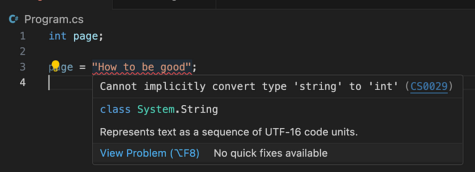

[It's also on Medium](https://medium.com/@lilychan1680806/absolute-basic-what-is-a-variable-8951d9ac1995)

If you are an absolute beginner who has just started programming, welcome! Let me explain the concept of variables in the plainest English ever!

## A variable is a bowl

Imagine a variable to be a bowl. It is a bowl for you to put things into it, like flour and sugar.

Here’s an example of how to define variables in Python:

```python
bowl1 = “flour”
bowl2 = “sugar”
```

`bowl1` is flour; `bowl2` is sugar.

**Note:** Variable names are case-sensitive and accept no space nor hyphens. They usually start with a lower-case letter.

Now, you can use the values by telling the computer which bowl to use.

For example, I would like the computer to tell me what’s inside my two bowls. To do that, I will use the `print()` method in Python.

```py
print("What's in bowl1: " + bowl1)
print("What's in bowl2: " + bowl2)
```

Now the computer tells me: ok they are flour and sugar correspondingly.

```python-repl
>>> print("What's in bowl1: " + bowl1)
What's in bowl1: flour
>>> print("What's in bowl2: " + bowl2)
What's in bowl2: sugar
```

**Note:** Make sure that whenever you use the variable, you spell everything **exactly the same** as how it is defined. Anything like `Bowl1` , `bowl 1` or `BOWL1` would not work.

## Some variables are type-specific

There are typed languages such as C# and TypeScript, where they are quite OCD about the types of variables.

For example, ramen bowls accept ramen in it.


^ Ramen from Studio Ghibli — Ponyo

Matcha bowls accept matcha in it.


^ Matcha bowl from Sing Tehus. Not a sponsor.

You don’t put ramen in a matcha bowl, or vice versa. It’s a crime. Don’t tell me you do it :(

In C# for example, defining a variable can look like this:

```csharp
string someString = “I am some words!”;
int anInteger = 10;
```

String bowls accept strings, which means words. Integer bowls accept integers, which means a complete number without any decimals.

You can find all available types by searching something like “C# types” or “TypeScript types”. Then you can find all possible options in their official documentation.

E.g.: C# [Built-in types](https://medium.com/r/?url=https%3A%2F%2Flearn.microsoft.com%2Fen-us%2Fdotnet%2Fcsharp%2Flanguage-reference%2Fbuiltin-types%2Fbuilt-in-types), TypeScript [Handbook — Basic Types](https://medium.com/r/?url=https%3A%2F%2Fwww.typescriptlang.org%2Fdocs%2Fhandbook%2Fbasic-types.html).

What I love about using a type-specific programming language is that it tells me immediately if I make a mistake. For example, if I assign the title of an article, which will be a string (e.g.: `"How to be good"`), to a variable called `page`, which should be a page number (e.g.: `1`), I will see an error straight away.


^ Seeing a type error immediately

That’s it! I think this is a lot to cover for absolute beginners, so well done! Hope you find this article helpful. Feel free to let me know if you have any questions. Happy coding!
