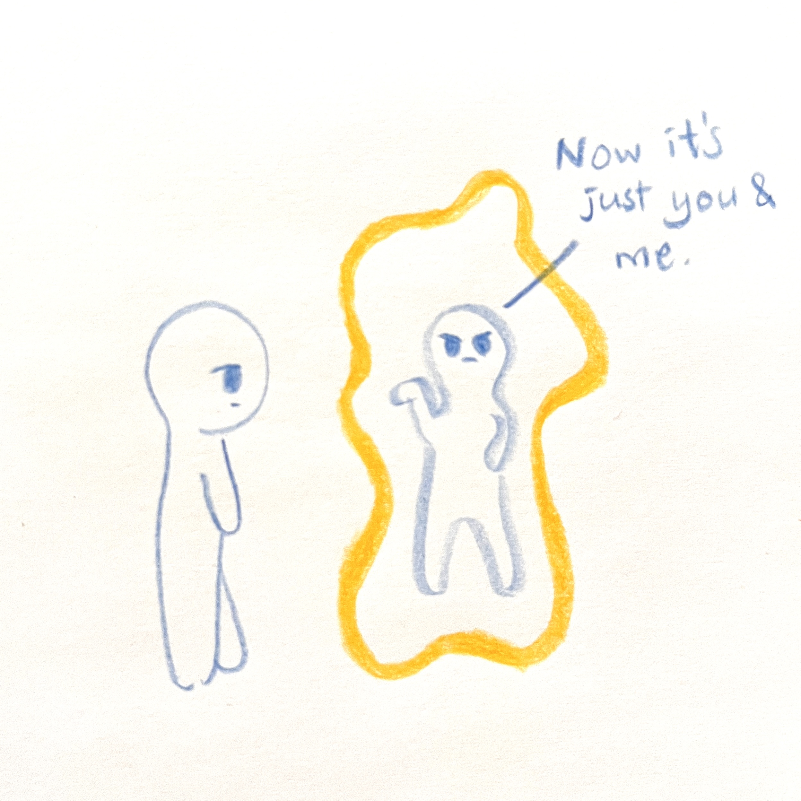
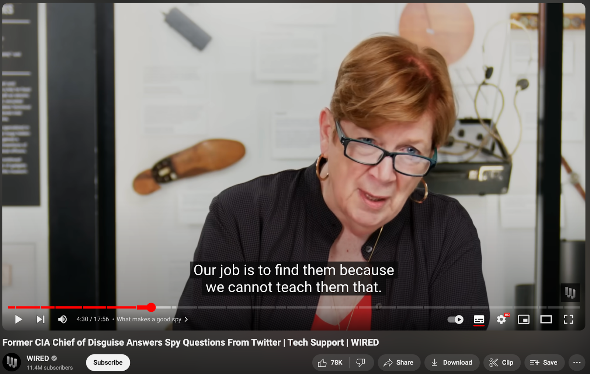

We are making great progress in breaking stereotypes, allowing even more people to enjoy the freedom to pursue whatever they love. However, it’s not like “happily ever after” and that’s it. This is just the beginning of a new self-exploration journey for many. If you are on this journey right now, there are probably times when you find yourself standing out. That can be lonely.

In this article, I hope to inspire you to be confident and comfortable in your own skin by sharing with you a bit of my own journey.

## Feeling like an outsider

It seems to be in my genes that I am a thrill-seeker. Which surprises me because I play no roller-coaster nor sky-diving. But I do long for adventures, for the kind that is uncharted and unescapable. So instead of jumping out of helicopters, I have been addicted to jumping out of my comfort zones. I have said goodbyes to many close friends, and made more new ones. Each knowing only one part of myself.

(image source: <https://www.youtube.com/watch?app=desktop&v=-OMbVGuDS_o>)

Although it’s all fun and exciting, the downside is I feel like an outsider most of the time. My mum said that I enjoyed observing other kids playing when I was small, standing far away by a slide that no one was using. But maybe I just didn’t know how to join them. I was probably imagining how fun it would be if I was one of them.

After moving to the UK and starting my Computer Science degree, I was very self-conscious – I look different. I talk differently, I act differently, I even think differently. I stand out. I felt lonely, no matter how many social gatherings I've attended.

## When it’s just you and yourself

It really doesn’t help if you can’t be your own supporter. There’s a saying from the book of Rites, “take care of yourself, then you can unite your home, then you can fix your country, and then you can bring world peace” (修身齊家治國平天下). Standing out is stressful. But how are you supposed to tackle the stress from the outside if you can’t even support yourself?

This is exactly the mistake that I made, and still make sometimes – I focus too much on what I should do right. The next moment I find myself stuck at the rabbit hole comparing myself with my perception of others, which is probably not a true image of who they are anyway. Being this nervous and tight removes my personal character and emotions, which is actually a pretty cold and scary look for others. The coldness in my heart is emitted out onto my skin.

So, imagine a loving, caring big sister-like figure. What would she tell you when you feel bad about yourself? Let her warm you up – let you warm yourself up.

## *Try* to fit in, and it’s okay if you don’t

Better to fail after trying something, than not trying anything. I tried wearing hoodies, jeans and a cap every day. It’s honestly a very comfortable outfit and I grew to like it. But then I tried to learn the British accents. Believe me, I struggled so much at pronouncing “wall” and “war” correctly. I still don’t get it even today.

But what’s more is, we are more than stereotypes — we are all unique. So yes, I looked more like my classmates, but still can’t talk like a proper British, nor understand what they’re saying. And it’s okay! Instead, if you can actually blend in and make friends straight away, you can consider applying to be a spy. It’s an unusual talent.

(link to video: <https://www.youtube.com/watch?v=XDBWjfUgaR8>)

## You are where you belong

It can still be sad to think of the fact that you still don’t fit in. “Doesn’t it mean that there’s something wrong with me?” I often ask myself this question. But dear, no dear. Sure, there are people who may not stop by and hang around, but there are also people who will. [Let them, just let them](https://youtu.be/8w_w1PhvXOE?si=i_1dRx50DGp5W1mp).

Remember the loving, caring big sister. Accept yourself for who you are, appreciate all your small and big things. Keep telling yourself so, and you, and the world, will eventually believe it. I highly recommend this video, and may this video be a good end of this article.

[Follow up to LET THEM](https://youtu.be/F306JD9fGG4?si=h0kc7zaRO_V1DtqV)
